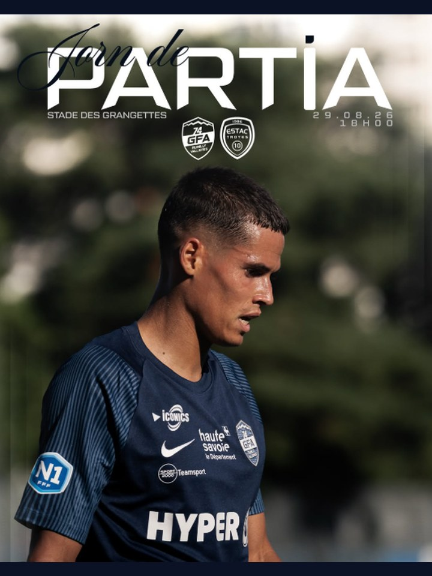

# Provenance des visuels

## Logos officiels

| Fichier | Source |
|---|---|
| `gfa.png` | gfa74.fr, `Logo_officiel_2021_GFA_Rumilly_Vallières.png` |
| `ils_logotype.png` | langue-savoyarde.com, `ELS_Logotype_FR_Principal_Couleur.png` |
| `ftalps.svg` | ftalps.com, `LOGO_French-tech_ALPES-small.svg` |

Universitât Sabauda et Savoy IA n'ont pas de logo public trouvé : traités en mot-image (Barlow Condensed) dans le deck. À remplacer par les logos officiels si disponibles.

## Images générées (Higgsfield, modèle `gpt_image_2`, 9:16, quality high, resolution 2k)

Sortie native 1520×2688, redimensionnée en 1080×1920 JPEG q82. Consigne commune : aucun texte, aucun logo, aucun lettrage lisible.

| # | Fichier | Job Higgsfield | Prompt |
|---|---|---|---|
| 1 | `01-stade-albanais.jpg` | `6cc0fb1c-28c4-42dc-b1b5-a037ba903aa6` | Cinematic vertical photograph, dusk. A small French regional football stadium in Rumilly, Haute-Savoie, seen from behind one goal at pitch level: floodlights just switched on, wet grass glistening, low modest stands. Behind the stadium, the massive silhouettes of the Bauges and Semnoz mountains under a deep navy-blue twilight sky with a thin band of pale gold on the ridge line. Moody, premium editorial look, shallow depth of field, cool blue palette with warm floodlight halos. No people in focus, no text, no logos, no signs. |
| 2 | `02-territoire.jpg` | `d854a066-41b5-4bdf-9ac0-a45479fdb3dc` | Vertical aerial landscape photograph of the Albanais countryside in Haute-Savoie at golden morning light: rolling green hills, hedgerows, a small town with a church steeple (Rumilly) in the middle distance, the river Chéran, and the Bauges massif and Semnoz rising in the background with a light haze. Rich, deep, cinematic colour grade with navy shadows and warm highlights. Premium documentary look, sharp, wide. No text, no logos. |
| 3 | `03-tribune.jpg` | `f5a7f476-c1b9-48ab-a0d9-cda663ae067c` | Vertical cinematic photograph, night match atmosphere in a small French stadium. Seen from behind: a dense crowd of local supporters in the stand, shoulders and raised arms, navy blue and white scarves held up, a man lifting a child on his shoulders, breath visible in the cold air, floodlight glare from above creating rim light on heads and scarves. Emotional, grainy, high contrast, deep blue and white palette. Faces not visible. No text, no logos, no readable lettering. |
| 4 | `04-partenaire.jpg` | `f03785e0-b119-4ade-b9e0-f140af16b926` | Vertical editorial photograph: at pitch side of a small football stadium at dusk, two business people in dark coats shake hands in the foreground, seen from chest level, faces cropped out of frame. Behind them, out of focus, illuminated advertising boards along the touchline glow in blurred bokeh (abstract, unreadable), green grass, floodlights. Premium, cinematic, navy and warm gold tones. No readable text, no logos. |
| 5 | `05-maillot-patrimoine.jpg` | `4fccba34-e31e-46ea-bb2d-166dd80302c8` | Vertical still-life photograph, dark studio: a heritage-style football shirt with a retro woven crest hangs on a wooden hanger against a deep navy wall, soft directional side light, visible fabric weave and embroidery, a folded vintage scarf on a wooden bench below. Nostalgic, premium, museum-like mood, warm highlights on navy. No readable text, no real club crest, no logos. |
| 6 | `06-col-chambery-turin.jpg` | `2e0535cd-f2c6-44fd-95e1-db5f3a32bcf4` | Vertical cinematic landscape photograph: the Alpine road over the Mont Cenis pass between Savoie and Piedmont at sunrise, winding tarmac with a lone car, snow-dusted peaks, the lake below, and in the far hazy distance the plain of Turin. Feeling of a crossing, a link between two sides of the mountains. Deep navy shadows, gold rim light on ridges, premium travel-editorial look. No text, no signs, no logos. |
| 7 | `07-terrain-nuit.jpg` | `b6b36ff3-626e-4376-9dbb-c8eab4629292` | Vertical cinematic photograph at night: an empty football pitch, centre circle in the foreground on wet grass, four tall floodlight masts, and behind the low stand the huge dark silhouette of Alpine mountains under a starry navy sky with a faint Milky Way. Silent, majestic, contemplative. Deep blue palette with cool white light. No people, no text, no logos. |
| 8 | `08-drapeau-savoie.jpg` | `4a312bd3-d270-4fb1-bf9b-8172f2c3df21` | Vertical photograph, tight detail: a large red flag with a white CENTERED cross whose four arms are equal and reach all the way to the edges of the flag (the historical flag of Savoy: a symmetric white cross on red, NOT the Danish off-centre cross), waving in a small football stadium stand at dusk, backlit by floodlights, fabric folds catching light, out-of-focus supporters and a navy sky behind. Textural, dramatic, cinematic grain, red and navy palette. No text, no logos, no lettering. |

Premier essai du drapeau (`74ccb738-6ff0-488f-9db8-8393806c271b`) écarté : croix décentrée façon Danemark.

## Portraits et logos ajoutés

| Fichier | Source | Traitement |
|---|---|---|
| `09-franck-portrait.jpg` | `franckmonod.eu/images/hero-portrait.jpg` | Recadré 1080×1160, converti en bichromie navy `#101A38` → `#E8EBF2`, dans l'esprit des affiches de match du club |
| `savoy-ia.png` | `ia.franckmonod.eu` | Tel quel |
| `ils_blanc.png` | Dérivé de `ils_logotype.png` | Version monochrome blanche générée à partir du logotype couleur. **À remplacer par le logo blanc officiel de l'Enstitut** (design kit « enstitut » dans Claude Design), non accessible depuis cette session |

## À fournir pour compléter le deck

- Les affiches du club en savoyard (`Jorn de partia`, `Victouèra`) en fichiers, pour la slide 04. Elles sont aujourd'hui citées en texte.
- Les deux écussons du Puy (ancien `Le Puy Foot 43 Auvergne`, nouveau `Le Puy-en-Velay FC`) pour la slide 06. Ils ne sont ni sur Wikimedia ni sur le site du club. La démonstration est aujourd'hui portée par le texte.

## Écussons du Puy (slide 06)

| Fichier | Source |
|---|---|
| `puy_ancien.svg` | Wikipédia, `Logo Puy Foot 43 Auvergne 2017.svg` |
| `puy_nouveau.svg` | Wikipédia, `Logo Le Puy en Velay FC - 2026.svg` |

Écussons de club tiers, repris à titre d'exemple comparatif. Le nouvel écusson a été dévoilé le 12 juin 2026 aux Halles du Puy-en-Velay, refonte par l'agence stéphanoise Bôjeu, aigle et lys tirés du blason de la ville, avec le slogan « Plus haut, ponots ».

## Affiches du club en savoyard (slide 04)

Non récupérables depuis cette session : elles ne sont publiées que sur les réseaux du club, et Instagram comme Facebook sont bloqués par la politique réseau de l'environnement. La slide cite les deux mots en pastilles typographiques, avec leur traduction. Pour les intégrer en image, déposer les fichiers dans le dossier `assets/` du dépôt, ou sur un Drive accessible.

## Comment poser les affiches sur la slide 04

Les trois vignettes de la slide 04 sont des emplacements. Déposer les fichiers dans `assets/` sous les noms `04-jorn-partia-1.jpg`, `04-jorn-partia-2.jpg` et `04-victouera.jpg`, puis remplacer chaque bloc

```html
<div class="ph" data-slot="jorn-partia-1"><span>Jorn de<br>Partia</span></div>
```

par

```html

```

Le cadre, le format 3:4, le filet rouge et la légende ne bougent pas.
